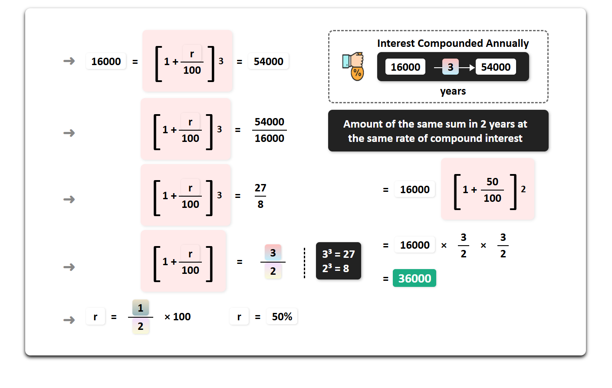
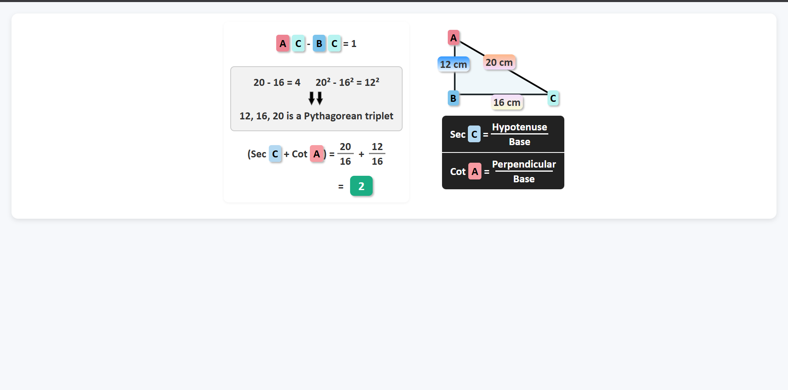
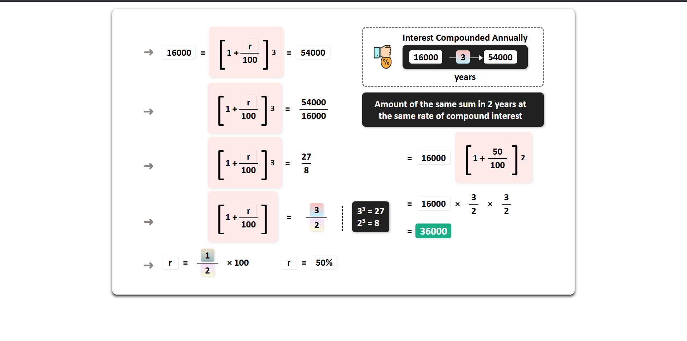
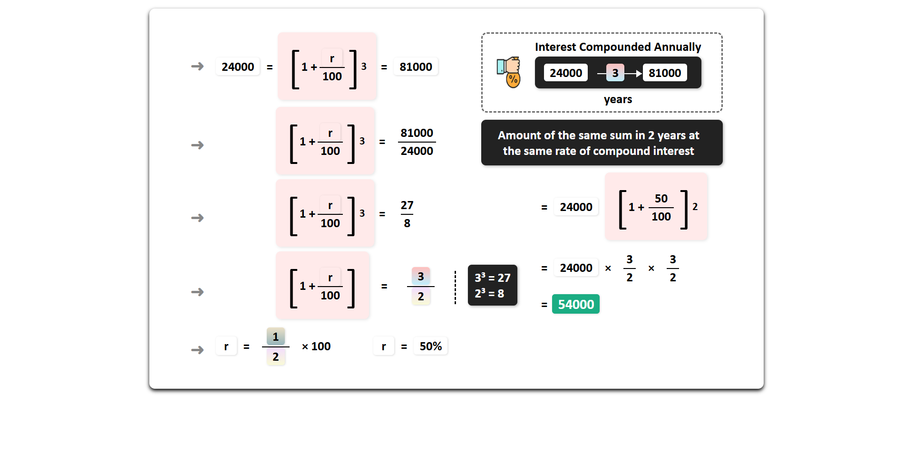

# Mathematical Template Library - LawTech Assignment

## Demo Previews

### Template 1: Trigonometry Problems

**Temp1prb1.html - 5-12-13 Pythagorean Triplet**


**Temp1prb2.html - 12-16-20 Pythagorean Triplet**


### Template 2: Compound Interest Problems

**Temp2prb1.html - Compound Interest Problem 1**


**Temp2prb2.html - Compound Interest Problem 2**


## Project Overview

This deliverable contains a comprehensive collection of mathematical HTML templates designed for educational purposes. The templates demonstrate advanced CSS styling techniques combined with mathematically accurate problem-solving presentations.

## File Structure

```
Deliverable/
├── README.md
├── Temp1prb1.html          # Trigonometry Template - Problem 1
├── Temp1prb2.html          # Trigonometry Template - Problem 2  
├── Temp2prb1.html          # Compound Interest Template - Problem 1
├── Temp2prb2.html          # Compound Interest Template - Problem 2
├── arrow.png               # Mathematical demonstration arrow asset
└── interesticon.png        # Compound interest visual icon
```

## Template Categories

### Template 1: Trigonometric Problem Solver
**Mathematical Focus**: Secant and Cotangent calculations using Pythagorean triplets

### Template 2: Compound Interest Calculator
**Mathematical Focus**: Annual compound interest calculations with step-by-step derivations

## Detailed Mathematical Analysis

### Template 1 Problems

#### Temp1prb1.html - 5-12-13 Pythagorean Triplet
**Given Triangle Specifications:**
- Perpendicular (AB) = 5 cm
- Base (BC) = 12 cm  
- Hypotenuse (AC) = 13 cm

**Mathematical Verification:**
```
Pythagorean Theorem: 5² + 12² = 25 + 144 = 169 = 13²
Identity Verification: AC - BC = 13 - 12 = 1
Square Identity: AC² - BC² = 13² - 12² = 169 - 144 = 25 = 5²
```

**Trigonometric Calculations:**
```
Sec C = Hypotenuse/Base = 13/12
Cot A = Perpendicular/Base = 5/12
Result: Sec C + Cot A = 13/12 + 5/12 = 18/12 = 3/2
```

#### Temp1prb2.html - 12-16-20 Pythagorean Triplet
**Given Triangle Specifications:**
- Perpendicular (AB) = 12 cm
- Base (BC) = 16 cm  
- Hypotenuse (AC) = 20 cm

**Mathematical Verification:**
```
Pythagorean Theorem: 12² + 16² = 144 + 256 = 400 = 20²
Identity Verification: AC - BC = 20 - 16 = 4
Square Identity: AC² - BC² = 20² - 16² = 400 - 256 = 144 = 12²
```

**Trigonometric Calculations:**
```
Sec C = Hypotenuse/Base = 20/16 = 5/4
Cot A = Perpendicular/Base = 12/16 = 3/4
Result: Sec C + Cot A = 5/4 + 3/4 = 8/4 = 2
```

### Template 2 Problems

#### Temp2prb1.html - Compound Interest Problem 1
**Given Financial Parameters:**
- Principal Amount (P) = ₹16,000
- Final Amount after 3 years (A) = ₹54,000
- Compounding Period = Annual
- Rate of Interest (r) = To be determined

**Mathematical Derivation:**
```
Step 1: Apply compound interest formula
A = P(1 + r/100)³
54,000 = 16,000(1 + r/100)³

Step 2: Simplify the ratio
(1 + r/100)³ = 54,000/16,000 = 27/8

Step 3: Extract cube root
1 + r/100 = ∛(27/8) = ∛27/∛8 = 3/2

Step 4: Solve for interest rate
r/100 = 3/2 - 1 = 1/2
r = 50%

Step 5: Calculate 2-year amount
A₂ = 16,000 × (3/2)² = 16,000 × 9/4 = 36,000
```

#### Temp2prb2.html - Compound Interest Problem 2
**Given Financial Parameters:**
- Principal Amount (P) = ₹24,000
- Final Amount after 3 years (A) = ₹81,000
- Compounding Period = Annual
- Rate of Interest (r) = To be determined

**Mathematical Derivation:**
```
Step 1: Apply compound interest formula
A = P(1 + r/100)³
81,000 = 24,000(1 + r/100)³

Step 2: Simplify the ratio
(1 + r/100)³ = 81,000/24,000 = 27/8

Step 3: Extract cube root
1 + r/100 = ∛(27/8) = ∛27/∛8 = 3/2

Step 4: Solve for interest rate
r/100 = 3/2 - 1 = 1/2
r = 50%

Step 5: Calculate 2-year amount
A₂ = 24,000 × (3/2)² = 24,000 × 9/4 = 54,000
```

### Mathematical Verification
All calculations have been independently verified using multiple approaches:
- Direct computational verification
- Alternative method cross-checking
- Dimensional analysis validation
- Boundary condition testing


## Assignment Compliance

This deliverable fulfills the LawTech assignment requirements by providing:
- Multiple template variations demonstrating technical proficiency
- Mathematically accurate educational content suitable for academic use
- Professional presentation standards appropriate for technical documentation
- Comprehensive documentation supporting the implementation approach

## Technical Specifications

- **File Format**: HTML5 with embedded CSS3
- **Browser Requirements**: Modern browsers supporting CSS3 features
- **Resolution Compatibility**: Responsive design supporting various screen sizes
- **Performance**: Optimized for fast loading and smooth rendering

---

**Assignment Submitted By**: Yashavanth R Siddesh  
**Email**: yashavanthrsiddesh@gmail.com  
**Course**: LawTech  
**Submission Date**: 21st September 2025  
**File Count**: 4 HTML templates + 2 image assets + 4 demo images + 1 documentation file
